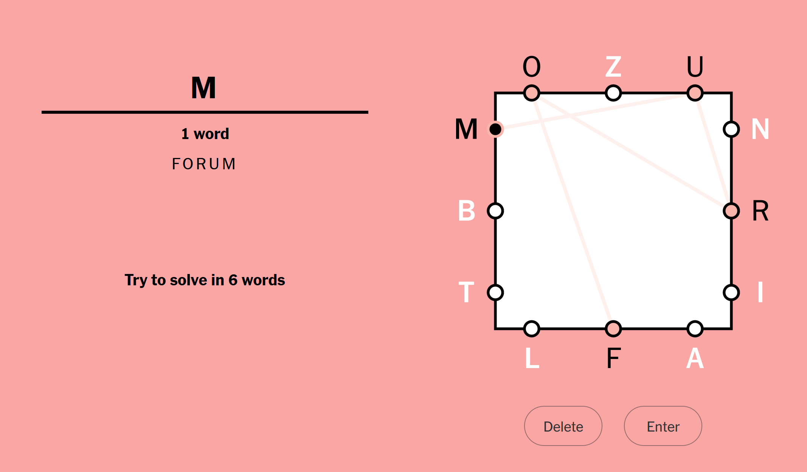

# Solving "Letter Boxed"
## Background
The New York Times, which has pivoted hard in recent times from being a newspaper to being a word puzzle website, has a game called [Letter Boxed](https://www.nytimes.com/puzzles/letter-boxed). It involves letters and a box, of course, with three letters arranged around each side of the box. The goal is to make words that use up all letters in the box, meeting the conditions:
* you must not use two letters from the same side in a row, and
* each subsequent word must start with the last letter of the previous word.

See the below image, the LB puzzle from Jan 2nd, 2023. I have entered the valid word "forum", and now it is expecting me to start the next word with an "m". Letters can be reused.



Even though this is possibly my least favorite of all the NYT games, my friends and I engaged in a considerable LB obsession a few months ago, eventually getting good enough to solve most puzzles in three or four words. In a moment of elevated inspiration, I decided to make a [small script](https://github.com/conor-mcavoy/letter-boxed) that could solve LB.

## Solution
First we define an object `Box` to hold the box and all the letters in it.
```python
class Box:
    def __init__(self, *sides):
        self.sides = sides
        self.letter_set = set(''.join(sides))
```
This allows us to create a box by specifying each side as a string, and keeps the sides handily separate. Plus, it calculates the "letter set", which is just the set of all letters in the box. There's no need for any sort of validation to check the number of letters or sides, or to check letter uniqueness, but we could add all this if desired.

Next, we need a way to determine if a word is valid for a given box. We can do that as a method in `Box`.
```python
def is_valid_word(self, word):
    if set(word) <= self.letter_set:
        for i in range(0, len(word) - 1):
            if not self.are_in_diff_sides(word[i], word[i + 1]):
                return False
        return True
    return False
```
This checks to make sure the letters in the candidate word are all valid letters for the box, i.e. they all show up on the box's sides in the first place. Then it checks that each pair of adjacent letters, starting with the first two, are on different sides of the box. Remember, LB solution words cannot have two adjacent letters on the same side of the box. We create a separate function for this check.
```python
def are_on_diff_sides(self, letter1, letter2):
    for side in self.sides:
        if letter1 in side:
            return letter2 not in side
        if letter2 in side:
            return letter1 not in side
    return False  # should never be reached
```
This function relies on the fact that the letters passed as parameters have already been verified to be in the box, hence the last line should never be reached. Then we simply iterate through all four sides of the box. As soon as we reach a side that has either letter in it, we check to see if it also has the other letter. If it does, then adjacent letters are invalid. Otherwise, this letter pair is acceptable, and we can move on.

So now we have a `Box` object that can validate candidate solution words. Next, we have to think about how to actually come up with these candidate words. There's probably some really smart things you can do to generate these words from scratch, but I decided to something more naive. We are going to list all possible words, and then use `is_valid_word` to filter the valid ones. Even with tens of thousands of words, this is easy and quick.

One more thing - how do we decide what a "good" candidate word is? There are going to be tons of valid words, especially short three-letter words. The goal here is to solve the puzzle in as few words as possible, so we should apply some sort of heuristic to avoid choosing such short words until absolutely necessary. Actually, we can do even better. We're really not trying to exclude _short_ words, but rather _words with few unique letters_.

As an example, say "lalalalala" was a valid word. Though this word is ten letters long, it's just as useful to us as the word "la", since both have two unique letters. We can sort all words by the number of unique letters in them, and call this their `word_score`.
```python
# the 'score' of a word is simply the number of unique letters it has
# this is the most valuable trait of a useful word in letter boxed
def word_score(word_):
    return len(set(word_))
```
As for how to get the list of "all" English words, you can do this in many ways. I just used the [`nltk` library](https://www.nltk.org/api/nltk.corpus.html), which is probably overkill. In reality, you don't want "all" English words, if such a thing is even possible, but rather all words that the NYT will accept. Maybe this can be found in the Javascript on the LB page, but I've found these `nltk` words work pretty well.
```python
from nltk.corpus import words

all_words = words.words()
```
Back to the candidate word sorting. We can make a map that maps every `word_score` to all words with that score, e.g. `3` will map to `['abc', 'abcb', 'baca', ...]` assuming those are valid words.
```python
# this map contains all known word scores, mapped to the words that have that score
def make_score_to_word_map(box):
    score_to_word_map = {}
    for word in all_words:
        if box.is_valid_word(word):
            score = word_score(word)
            if score in score_to_word_map:
                score_to_word_map[score].append(word)
            else:
                score_to_word_map[score] = [word]
    return score_to_word_map
```
This is where we filter out the invalid words. For each valid word, calculate the score and add it to the big map. The maximum possible score of a valid word is twelve. This would indicate the word solves the LB all by itself, which I've never seen happen in practice but is surely possible. We can check that case and return. I'm going to use the Jan 2nd, 2023 Letter Boxed as an example, but this code was originally written in Sep of 2022.
```python
jan_2 = Box('ozu', 'nri', 'lfa', 'mbt')
todays_map = make_score_to_word_map(jan_2)
if 12 in todays_map:
    print(todays_map[12])
    exit()
```
If a one-word solution doesn't exist, the next thing to check is for two-word solutions. This is where the code gets frustrating in my opinion. Before finishing this, I was imagining some very cool recursive stuff that would search the solution space, starting with a candidate word and extending the list of words until it had a valid solution. This would allow for searching for solutions of any length. However, what I discovered was that every puzzle pretty much has a two-word solution. Two-word solutions have the dual properties of being the easiest solutions for a computer to find (under these circumstances) and the hardest for humans to find, making this a particularly unsatisfying place to stop. Here is a sample of solutions this code typically finds:
```
['tanzib', 'bulimiform']
['tanzib', 'bulimiform']
['toruliform', 'mobilization']
['toruliform', 'mobilization']
['tubiform', 'manzil']
['tubiform', 'manzil']
```
You get the idea. Yet I didn't go any further by implementing three-or-more-word solutions, since I didn't feel any need to search for suboptimal solutions. I built a tool to "minimize N under conditions X", and it did it - why would I rework the tool because N is too small for my liking? But that means few of these solutions appear human at all, and they usually contain very obscure words.

So how to find a solution? We have a map of `word_scores` and essentially need to find two words whose `word_scores` "add up" to twelve. I say "add up" since you can't just add two `word_scores` together, you need to actually calculate how many unique letters two words have together. We can start with the maximum-scored word, which we already know is less than 12 - let's say it's 8. Call this the first word. Then we can search for second words that meet the following conditions:
* the word must have a score of 12 - 8 = 4 or higher,
* the word must start with the last letter of the first word, and
* the two words together must have a score of 12.

We can also do a little better. We made the max-score word the first word, but there's no reason it couldn't be the second word, and then the search above could be for the first word. So we can also accept words that end with the first letter of the max-score word. We should start searching with the smallest score, in this case 4, and go up from there, since this will give us solutions with the smallest possible words.

Let's modify the `word_score` function to work with multiple words.
```python
def word_score(*word_list):
    return len(set(''.join(word_list)))
```
Now we make a function that can perform the search above, given the number of "points" left to search for (in the above example, 4) and the starting word, as well as the pre-generated score map.
```python
def find_solution(dict_word_score, points_left, starting_word):
    solution_list = []
    first_letter = starting_word[0]
    last_letter = starting_word[-1]

    for score_to_search in range(points_left, 13):
        if score_to_search not in dict_word_score:
            continue
        current_words = dict_word_score[score_to_search]
        for candidate_word in current_words:
            # has to start with the last letter or end with first letter
            if candidate_word[0] == last_letter:
                if word_score(candidate_word, starting_word) == 12:
                    solution_list.append([starting_word, candidate_word])
            elif candidate_word[-1] == first_letter:
                if word_score(candidate_word, starting_word) == 12:
                    solution_list.append([candidate_word, starting_word])
    return solution_list
```
And that's essentially it. We also can set up some code to start with the max-score word(s) as described, iterate down with lower-scoring starting words, build up a solution list from that, sort it, and print it. Note that the below code searches for max-scores down to 6, since any lower scores will not be able to produce a two-word solution anyway.
```python
highest_score = max(todays_map.keys())
all_solutions = []
for first_word_score in range(highest_score, 5, -1):
    if first_word_score in todays_map:
        for first_word in todays_map[first_word_score]:
            all_solutions.extend(find_solution(todays_map, 12 - first_word_score, first_word))

all_solutions.sort(key=lambda x: x[1])
all_solutions.sort(key=lambda x: x[0])
for solution in all_solutions:
    print(solution)
```
This should give all two-word solutions, and most LBs have dozens.

## Further Ideas
* Some sort of heuristic for "good" and "bad" starting and ending letters. It's probably bad to start/end with an "x" for example, not many words start/end with an "x". 
* Recursive solutions in case two-word solutions aren't possible.
* Generate solutions of size N on demand.

## Thanks
Thanks to Kyle Harvey for helping make this code.
