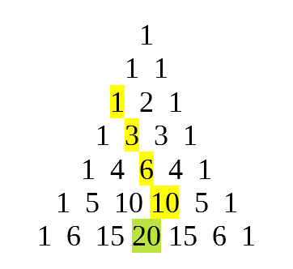

# On Hockey Sticks
Safe to say my family is a hockey family. I'm a big Carolina Hurricanes fan, while the rest of my family loves the Boston Bruins to various extents. My dad is the one who got us all into it, as he played hockey as a kid growing up in Massachusetts and in college at West Point. I played for many years as a child. So ever since I first came across the [hockey-stick identity](https://en.wikipedia.org/wiki/Hockey-stick_identity), I've been waiting to use it (in a non-contrived problem).

## The Identity
The page above does a great job explaining the identity (apparently also known as the Christmas stocking identity, boomerang identity, Fermat's identity or Chu's Theorem), but I will summarize. It basically says if you add up a bunch of numbers on Pascal's triangle in a diagonal line, the sum is the number at the end of the line, but off to the side. The most important thing to realize is that the _shape_ of the numbers involved looks like a hockey stick.



To understand intuitively why this works, without any combinatoric arguments, remember that every number on Pascal's triangle is the sum of the two above it. Imagine, instead of that highlighted 1, that the 1 directly to the bottom left of it were highlighted. Then the identity is obvious: 1+3 is 4, 4+6 is 10, and so on until your answer. Of course, if that other 1 was highlighted, it wouldn't quite make a hockey stick. Maybe a broken hockey stick, which happens.

Anyway, in my experience this identity is typically taught only in a combinatorics class, or perhaps a proofs class. At that point, it is introduced more as a proof exercise, the student is given one or two obvious problems that require the identity, and then it is promptly forgotten and never used again.

## The Problem
Recently I was busily working through "Abstract Algebra: A Geometric Approach" by Theodore Shifrin, an excellent book that motivates abstract algebra from entirely geometric perspectives. At the end of the chapter on polynomials, I came across the following problem:

3.3.7: Prove that for any prime number $$p$$, $$f(x) = x^{p-1} + x^{p-2} + \cdots + x + 1$$ is irreducible in $$\mathbb{Q}[x]$$. (Hint: Consider $$f(x+1)$$.)

Keep in mind, as I am approaching this problem, the hockey stick identity is the farthest thing from my mind. The book makes no mention of it.

In brief, the problem is asking us to prove that that polynomial cannot be written as a product of other polynomials (reduced) if we restrict ourselves to polynomials with rational coefficients ($$\mathbb{Q}$$).

Well first, let's use the hint. The hint was absolutely crucial here, I have no idea how I'd begin this problem otherwise. I wanted to generate a few examples of what $$f(x)$$ and $$f(x+1)$$ look like for small $$p$$:
 - $$p = 2$$ gives $$x + 1$$ and $$x + 2$$
 - $$p = 3$$ gives $$x^2 + x + 1$$ and $$x^2 + 3x + 3$$

At this point, I decided to use Python to generate a few more. [SymPy](https://scipy-lectures.org/packages/sympy.html) does this well:
```python
import sympy
x = sympy.Symbol('x')
for p in [2, 3, 5, 7, 11, 13]:
    polynomial = 0
    for k in range(0, p):
        polynomial += (x+1)**k
    print(sympy.expand(polynomial))

x + 2
x**2 + 3*x + 3
x**4 + 5*x**3 + 10*x**2 + 10*x + 5
x**6 + 7*x**5 + 21*x**4 + 35*x**3 + 35*x**2 + 21*x + 7
x**10 + 11*x**9 + 55*x**8 + 165*x**7 + 330*x**6 + 462*x**5 + 462*x**4 + 330*x**3 + 165*x**2 + 55*x + 11
x**12 + 13*x**11 + 78*x**10 + 286*x**9 + 715*x**8 + 1287*x**7 + 1716*x**6 + 1716*x**5 + 1287*x**4 + 715*x**3 + 286*x**2 + 78*x + 13
```

See the pattern? We are looking at Pascal's triangle! With one slight wrinkle, the last coefficient of 1, the right side of the triangle, is missing. We shall see if that matters. First let's prove what we are observing.

## The Proof
Consider the expansion of $$f(x+1) = (x+1)^{p-1} + (x+1)^{p-2} + \cdots + (x+1) + 1$$. The coefficient of $$x^{p-1}$$ in the expansion is clearly $$1$$, as only the first term $$(x+1)^{p-1}$$ contributes to this term in the expansion. We observe this above in the Python output.

What about the coefficient of $$x^{p-2}$$ (assuming $$p > 2$$)? There are two contributors to this term, the first and second terms of $$f(x+1)$$. By the rules of binomial expansion, we have $$\binom{p-1}{1} + \binom{p-2}{0} = p-1+1 = p$$, so the coefficient of $$x^{p-2}$$ is $$p$$. We also see this in the Python output. Note we are constructing Pascal's triangle column by column.

Next, consider $$x^{p-3}$$ (again, $$p>3$$ here). The first three terms constribute, so we have $$\binom{p-1}{2}+\binom{p-2}{1}+\binom{p-3}{0} = \sum_{j=0}^3 \binom{j+p-3}{j}$$. At this point, dealing with longer and longer runs of numbers on Pascal's triangle summing to another number on the triangle, it suddenly occurred to me to use the hockey stick identity! In common form, the identity states $$\sum_{i=r}^n \binom{i}{r} = \binom{n+1}{r+1}$$. We need to make the substitution $$j=i-r$$ and use symmetrical properties of the binomal coefficent to "reverse" the stick: $$\sum_{j=0}{n-r} \binom{j+r}{j} = \binom{n+1}{n-r}$$, and here $$n=p$$ and $$r=p-3$$, or $$p-k$$ for suitable $$k$$ as we iterate down the line.

So what have we shown? In the final expansion, the coefficient of $$x^{p-k}$$ for $$k=1,\dots,p$$ is equal to $$\binom{p+1}{k}$$. Note that when we get to $$k=p$$, we have $$\binom{p+1}{p} = p$$, so we haven't constructed the full triangle, we are missing the rightmost column as noted above. But does this matter?

Remember what we are actually trying to show: $$f(x)$$ is irreducible. At this point I had another idea to use [Eisenstein's criterion](https://en.wikipedia.org/wiki/Eisenstein%27s_criterion). This one was not as much a stroke of genius, as the chapter had already covered it. The general idea there is, if every coefficient is divisible by some $$p$$ _other than the first one_ and the last coefficient is not divisible by $$p^2$$, then the polynomial is irreducible.

Luckily, we have just that!. The first coefficient is always $$1$$ as we noted. For $$k=2,\dots,p-1$$, $$\binom{p+1}{k} = \frac{(p+1)!}{k!(p+1-k)!}$$ which is always divisible by $$p$$. Finally, for $$k=p$$, we noted above that it is $$p$$. It's just perfect that we _didn't_ make the whole triangle, as a rightmost column of ones would have screwed up this proof!

All we have done above is show $$f(x+1)$$ is irreducible, and this means $$f(x)$$ is reducible too, or else if $$r$$ were a root of the former then $$r+1$$ would be a root of the latter. QED.

## Conclusion
This problem was a delight to solve, and offered me a rare chance to have a real "eureka" moment, as the hockey-stick idea came to me like lightning. Most math is not like that, it's much more deliberate and careful, at least for me. That's why I wanted to share this lovely problem and its solution.